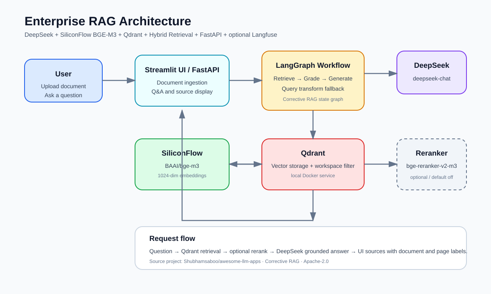
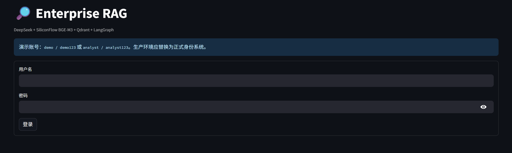
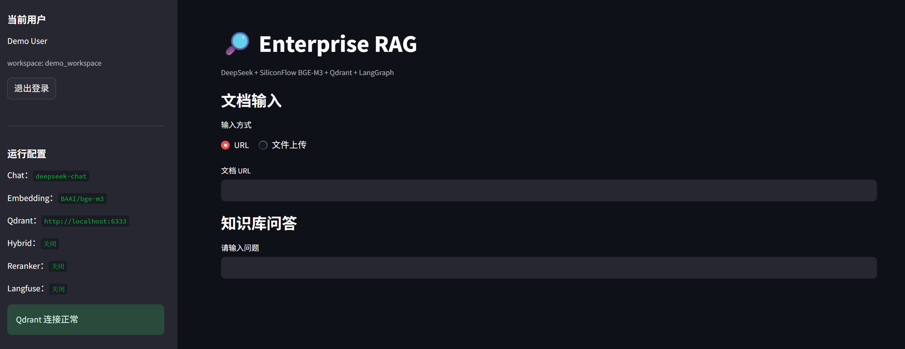
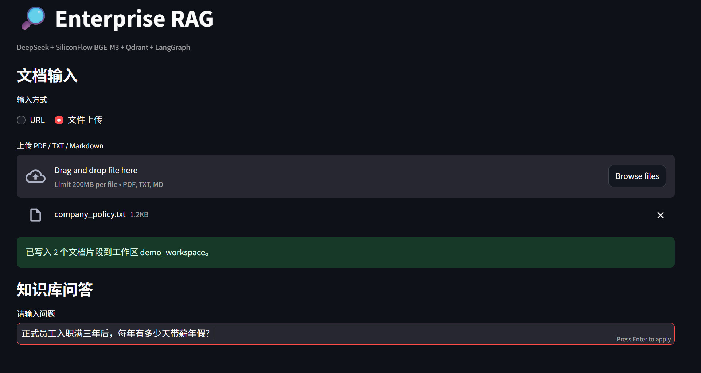
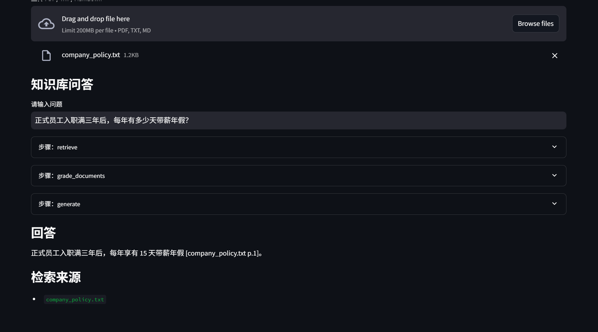

# Enterprise RAG

A portfolio-ready enterprise knowledge-base assistant built from a Corrective RAG
workflow. It uses DeepSeek for grounded generation, SiliconFlow `BAAI/bge-m3`
for embeddings, Qdrant for vector search, and Streamlit for the UI.



## Highlights

- Local demo login with PBKDF2 password hashes
- Workspace-level document isolation enforced in Qdrant payload filters
- PDF, TXT, Markdown, and URL ingestion
- Chinese-aware recursive chunking
- DeepSeek relevance grading, query rewriting, and grounded answers
- SiliconFlow 1024-dimensional BGE-M3 embeddings
- Optional hybrid vector + BM25 retrieval with Reciprocal Rank Fusion
- Optional BGE reranker with automatic fallback
- Page/source labels returned separately from generated answers
- FastAPI JSON and SSE streaming APIs with API-key authorization
- Optional Langfuse query tracing
- Repeatable 8-question RAG benchmark
- Secrets stored locally in `.env` and excluded from Git
- Apache-2.0 derivative with upstream attribution

## Screenshots

### Login



### Workspace dashboard



### Document upload and ingestion



### Grounded answer and sources


## Evaluation

The benchmark uses `samples/company_policy.txt`, which is split into 4 chunks.
It measures whether the expected fact appears in the answer, whether a citation
is present, and end-to-end latency.

| Configuration | Keyword accuracy | Citation rate | Average latency |
|---|---:|---:|---:|
| Vector retrieval only | 100% | 100% | 815 ms |
| Vector retrieval + BGE reranker | 100% | 100% | 940 ms |
| Hybrid vector + BM25 RRF | 100% | 100% | 889 ms |
| Hybrid vector + BM25 RRF + BGE reranker | 100% | 100% | 1081 ms |

All configurations answer the benchmark correctly, but the small corpus does
not provide enough retrieval difficulty to show an accuracy gain from Hybrid or
Reranker. Vector-only retrieval is fastest, so Hybrid and Reranker are available
but disabled by default.

Detailed results:

- `eval/comparison.md`
- `eval/results_vector_v3.json`
- `eval/results_vector_reranker_v3.json`
- `eval/results_hybrid_v3.json`
- `eval/results_hybrid_reranker_v3.json`

## Architecture

```text
User and workspace login
  -> Streamlit document upload / question
  -> LangGraph Corrective RAG workflow
  -> Qdrant vector retrieval with workspace_id filter
  -> optional BM25 retrieval + RRF fusion
  -> optional SiliconFlow BGE reranker
  -> DeepSeek grounded answer
  -> answer plus document/page source labels
  -> optional Langfuse trace
```

Embedding:

```text
Text chunks -> SiliconFlow BAAI/bge-m3 -> 1024-dim vectors -> Qdrant
```

## Quick Start

### 1. Start Qdrant

```powershell
docker pull docker.m.daocloud.io/qdrant/qdrant:latest

docker run -d `
  --name qdrant-local `
  -p 6333:6333 `
  -p 6334:6334 `
  -v qdrant_storage:/qdrant/storage `
  docker.m.daocloud.io/qdrant/qdrant:latest
```

### 2. Configure secrets

Copy `.env.example` to `.env` and set:

```env
DEEPSEEK_API_KEY=...
SILICONFLOW_API_KEY=...
```

### 3. Create the Python environment

```powershell
uv venv --python 3.12.14 .venv
.\.venv\Scripts\Activate.ps1
uv pip install --index-url https://pypi.tuna.tsinghua.edu.cn/simple -r requirements.txt
```

### 4. Check services

```powershell
.\.venv\Scripts\python.exe scripts\check_apis.py
.\.venv\Scripts\python.exe scripts\check_auth.py
.\.venv\Scripts\python.exe scripts\check_api_service.py
.\.venv\Scripts\python.exe scripts\check_reranker.py
.\.venv\Scripts\python.exe scripts\check_isolation.py
.\.venv\Scripts\python.exe scripts\check_langfuse.py
```

Expected:

```text
DeepSeek: OK
SiliconFlow embedding: OK (dimension=1024)
Qdrant: OK
SiliconFlow reranker: OK
API health: OK
API authentication: OK
API chat: OK
API stream: OK
Authentication: OK
Workspace binding: OK
Workspace isolation: OK
BM25 search: OK
Hybrid RRF retrieval: OK
Langfuse: DISABLED (optional)
```

### 5. Run the UI

```powershell
.\.venv\Scripts\python.exe -m streamlit run app.py
```

Open `http://127.0.0.1:8501`.

Demo accounts:

```text
demo / demo123       workspace: demo_workspace
analyst / analyst123 workspace: analyst_workspace
```

Upload `samples/company_policy.txt` and ask:

```text
正式员工入职满三年后，每年有多少天带薪年假？
```

Expected answer: `15 天`, with source labels displayed below the answer.

## API and Streaming

Start FastAPI:

```powershell
.\.venv\Scripts\python.exe -m uvicorn api:app --host 127.0.0.1 --port 8000
```

OpenAPI docs: `http://127.0.0.1:8000/docs`

Endpoints: `/health`, `/v1/documents`, `/v1/chat`, `/v1/chat/stream`.

API keys are mapped to workspaces in `.env`:

```env
DEMO_API_KEY=demo-api-key
ANALYST_API_KEY=analyst-api-key
```

See `docs/api.md` for examples.

## Docker Compose

```powershell
docker compose up --build
```

Ports: Qdrant `6333`, FastAPI `8000`, Streamlit `8501`. See `docs/deployment.md`.
## Workspace Isolation

- `users.json` contains PBKDF2 password hashes and workspace IDs.
- Every Qdrant payload includes `workspace_id` and `user_id`.
- Every retrieval uses a mandatory `metadata.workspace_id` filter.
- Re-uploading a file only removes points from the same workspace and file.
- `users.json` is ignored by Git; `users.example.json` is committed for demo use.

## Hybrid Retrieval

Enable hybrid retrieval in `.env`:

```env
ENABLE_HYBRID_SEARCH=true
```

The workflow then:

1. Retrieves vector candidates from Qdrant.
2. Builds a BM25 index from the current workspace.
3. Fuses vector and BM25 rankings with Reciprocal Rank Fusion.
4. Passes the fused candidates to generation or an optional reranker.

## Reranker

Enable in `.env`:

```env
ENABLE_RERANKER=true
RERANKER_MODEL=BAAI/bge-reranker-v2-m3
RETRIEVAL_TOP_K=10
RERANK_TOP_N=5
```

If the reranker API fails, the application falls back to the original ranking.

## Langfuse

Langfuse tracing is optional and disabled by default. Configure:

```env
LANGFUSE_ENABLED=true
LANGFUSE_PUBLIC_KEY=...
LANGFUSE_SECRET_KEY=...
LANGFUSE_HOST=https://cloud.langfuse.com
```

Each query creates a trace with one span per LangGraph node.

## Benchmark

```powershell
$env:ENABLE_HYBRID_SEARCH='false'
$env:ENABLE_RERANKER='false'
$env:EVAL_OUTPUT='results_vector_v3.json'
.\.venv\Scripts\python.exe scripts\evaluate_rag.py
```

See `eval/comparison.md` for all four configurations.

## Project Structure

```text
enterprise-rag/
|-- app.py
|-- api.py
|-- auth.py
|-- rag_core.py
|-- Dockerfile
|-- docker-compose.yml
|-- requirements.txt
|-- .env.example
|-- users.example.json
|-- samples/
|   \-- company_policy.txt
|-- scripts/
|   |-- check_api_service.py
|   |-- check_apis.py
|   |-- check_auth.py
|   |-- check_isolation.py
|   |-- check_langfuse.py
|   |-- check_reranker.py
|   |-- evaluate_rag.py
|   |-- smoke_hybrid.py
|   \-- smoke_rag.py
|-- eval/
|   |-- questions.json
|   |-- comparison.md
|   \-- results_*.json
|-- docs/
|   |-- api.md
|   |-- architecture.svg
|   |-- demo-script.md
|   |-- deployment.md
|   \-- resume-bullets.md
|-- UPSTREAM.json
\-- LICENSE
```
## Design Decisions

- DeepSeek handles Chat, relevance grading, query rewriting, and grounded answer generation.
- SiliconFlow provides BGE-M3 embeddings and the optional BGE reranker.
- Qdrant stores document content, metadata, and workspace identity in a shared collection.
- Workspace isolation is enforced at query time rather than by separate collections.
- Hybrid and reranking are optional because the current small benchmark shows no accuracy gain.
- Tavily web search remains disabled for the local-first version.

## Roadmap

- Production identity provider and role-based access control
- More realistic multi-hop and noisy retrieval benchmark
- Langfuse cost and token dashboards
- FastAPI streaming endpoint
- Docker Compose deployment
- Public hosted demo

## Upstream and License

This project is a derivative of:

```text
Shubhamsaboo/awesome-llm-apps
rag_tutorials/corrective_rag
License: Apache-2.0
```

The exact upstream commit and path are recorded in `UPSTREAM.json`. The original
license is retained in `LICENSE`.
